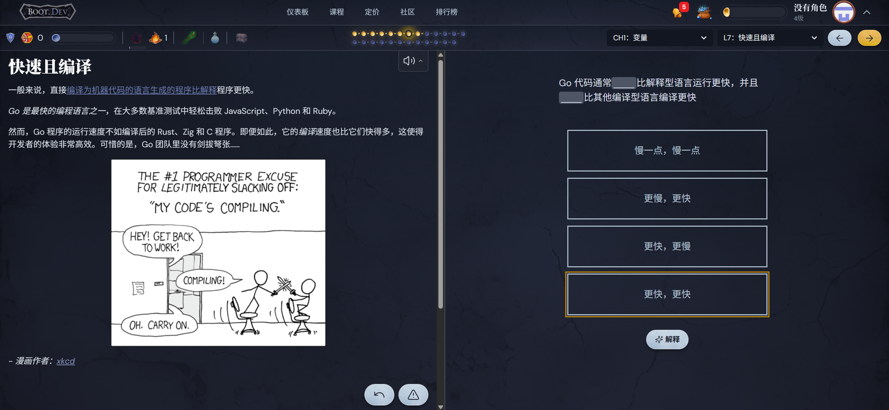

# review
3个星期，Go语言从不入门到入门，win!🥳

回头看看来时路~

**Go (Golang)：云原生时代的宠儿**

你就是这样被偏上Go学长的贼船的？？😋

## ch0
go的基础环境配置等，`go mod`等tools打造大Go盛世，便捷性 & 可移植性++

## ch2
变量的命名、类型、声明、赋值等，我们go也要有自己的骚操作！e.g.`a := 1`

`package`是Go架构的一大特色，就像Python的库一样，随地大小`import`，`go mod`也难辞其咎

## ch10
`package`到底何方神圣？怎么用？dps多少...？咳咳，总之确实挺不戳的，你也来`import`一下吧！

go tools也是go魅力所在，像`pip install`一样`go get`，怎么样，是不是心动了？

不得不说，go的环境配置和版本管理真王朝了，一发`go mod tidy`直接绝杀一众什么`conda install`了，打python像打宝宝一样，没说你是吧java😋👊

## ch3
基础数据类型e.g.`int`, `float64`等

没有`long long`力（悲）

## ch4
复合数据类型
`Array`遭受如此冷落的语言还是第一次见，被`Slice`吊起来打，我喜欢😋👍

哈希表`Map`无需多盐，`type struct`也是继承C学长的衣钵了，面向对象的基础~（当然Go是自由的，可以面向对象但不必拘泥于面向对象，这也是为什么不`Class`的原因）（万一真有了记得喊我回来见证历史）

## ch5
函数func 梦开始的地方`func main()`

玩的比较花，特别是多返回值，确实有点更像Python了，lambda函数更是更胜C学长一筹，想用就用

一等公民`function`，给人func当成变量用了，C/C++真得学学吧

## ch5-2
比error更error的panic

处理panic，C是`throw` & `catch`，Go这里是`recover`捕获异常，`defer`延迟函数殿后兜底，当然因为太好用了被`mutex.Unlock()`等给叫去当雇佣兵了

## ch6
方法method，Go属于高贵的OOP面向对象语言的一大证明，给`type struct{}`装上成员函数

## ch7
接口interface，OOP实现抽象多态的基础，不同类型但有相似操作，写一个接口对这种操作进行抽象，然后大家都可以用了，比如劳模`io.Writer`的`Write()`接口

书中的tips:不要为了抽象而抽象，是水到渠成的抽象；就像不要为了OOP而OOP，是水到渠成的OOP（好像不太像呢），小接口大作用是最高追求

## ch8
go也要有自己的线程~
goroutines携程，`go func()`就可以跑一个线程一样的东西执行操作，是go并发的基础，也是云原生时代大Go帝国的统治根基

为了方便不同goroutine之间的通信，发明了管道channel，就像C pipeline一样，读端写端，进程通信

## ch9
synchronization，OS厨狂喜，是mutex迟早会锁上的

`sync.mutex`互斥锁，`Lock() & Unlock()`操作，`sync.WaitGroup`实现`wait()`等，甚至channel也能来露两手

## ch11
go test，没有样例和判题机我就自己造

测试可是一大部门，不要小看了我们test玩家，也是很不容易的好不好，你说QQ新版本哪有QleetcodeQ来给它测一测呢

## ch1
真·入门，举几个例子，有些常用的包以及使用示例，命令行交互，文件操作，图像/动画操作，网络操作，并发操作，Web服务等，这下真成服务器力！

## ch12
反射reflect，动态类型动态值，Type and Value

## ch13
底层编程，unsafe，指针Pointer都来了我信了

cgo在Go里跑C代码，C老弟，叫声Go学长听听！😋

## Why do we go?

faster and more convenient
while easy and comprehensive

最后，用Go快乐地编程。我们希望你能像我们一样喜欢Go语言。
$~~~~~~~~~~~~~~~~~~~~~~~~~~~~~~~~~~~~~~~~~~~~~~~~~~~~~~~~~~~~~~~~~~~~~~~~~~~~~~~~~~~~~~~~~~~~~~~~$——《Go语言圣经》

❀❀完结撒花❀❀
