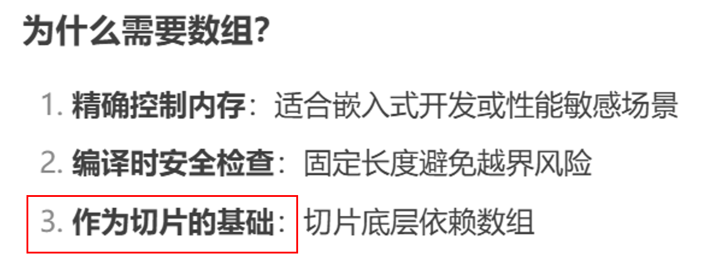

# 复合数据类型

# 数组
arrays nerve die!😘

但数组在Go中并不常用，因为

有更好用的切片`Slice`！

slice动态长度更灵活，但array固定长度

当初叫人小a，现在叫人定长数组😭

但是没有我数组，哪来的你切片😡


《作为切片的基础》（我有鱼鱼症.jpg）

## 声明 & 初始化
```go
var arr1 [3]int
var arr2 = [3]int{1, 2, 3}

// 自动长度推断
arr3 := [...]int{4, 5, 6}
// 指定下标的初始化
arr4 := [5]int{1: 10, 3: 20} // [0, 10, 0, 20, 0]

// 多维数组
var matrix [2][3]int      // 2行3列
matrix = [2][3]int{
    {1, 2, 3},
    {4, 5, 6},
}
fmt.Println(matrix[1][2]) // 输出: 6
```

## 访问 & 修改
```go
arr := [3]string{"Go", "Python", "Java"}
fmt.Println(arr[0])   // 输出: "Go" (索引从0开始)
arr[1] = "Rust"       // 修改元素
```
Rust学长这招太狠了

## 遍历
```go
// length := len(arr) // len()获取长度

// for 循环
for i:=0; i<len(arr); i++ {
    fmt.Println(arr[i])
}

// range关键字
for index, value := range arr {
    fmt.Println(index, value)
}

/*
颇有故人之姿.py
arr = ["Red", "Green", "Blue"]
for index, value in enumerate(arr):
    print(index, value)
*/
```

## 值传递？
```go
func modifyArray(arr [3]int) { // 值传递
    arr[0] = 100 // 只修改副本
	// unused write to array index 0:int
}

func main() {
	a := [3]int{1, 2, 3}
    modifyArray(a)
    fmt.Println(a) // 输出: [1 2 3]（原数组未改变）
}
```

值传递？引用传递！🤓👆
还是忘不掉啊C学长

哪来的引用传递，指针！
```go
func modifyArray(arr *[3]int) { // 接收数组指针
    arr[0] = 100 // 直接修改原数组
}

func main() {
    a := [3]int{1, 2, 3}
    modifyArray(&a) // 传递指针
    fmt.Println(a) // 输出: [100 2 3]
}
```

或者，用切片！😋
切片天生就是引用类型😋😋

活在切片的阴影里，md你来当数组吧🤬

## 长度决定类型？
```go
func lensTypes() {
	a := [3]int{1, 2, 3}
	b := [3]int{1, 2, 3}
	fmt.Println(a == b) // true 长度相等值也相等
	// c := a + b  ×，不能直接加

	// c := [5]int{1, 2, 3, 4, 5}
	// d := [3]int{1, 2, 3}
	// fmt.Println(c == d) // × invalid operation: c == d (mismatched types [5]int and [3]int)
	// 长度不等直接不能 == 比较

	b = [3]int{4, 5, 6}
	fmt.Println(a == b) // false 长度相等，值不相等也不相等
}
```

# 切片
数组以后不要再联系了，我怕切片误会😋

**动态数组**
vector?😘

## 底层结构
```go
type SliceHeader struct {
    Data uintptr  // 指向底层数组的指针
    Len  int      // 当前长度
    Cap  int      // 总容量
}
```

长度——现有长度
容量——最大容量


## 创建
```go
// 从数组创建
arr := [5]int{10, 20, 30, 40, 50}
s1 = arr[1:3] // [20, 30] 下标的[1:3]左闭右开

// 直接声明
var s2 []int
s3 := []int{1, 2, 3}

// make()
// 默认容量 = 长度，也可以指定
s4 := make([]int, 3)     // 长度=3，容量=长度=3，元素初始化为0
s5 := make([]int, 2, 5)  // 长度=2，容量=5
```

## 基本操作
```go
// 访问 & 修改
s := []string{"Go", "Python", "Java"}
fmt.Println(s[0])
s[1] = "Rust"

// len() cap()
length := len(s) // 长度
capacity := cap(s) // 容量

// append()  push_back()?
s = append(s, "C")
// 同vector自动扩容
// len == cap时，append()触发扩容
// cap < 1024时 双倍扩容
// cap >= 1024时 1.25倍扩容
fmt.Println(s) // ["Go", "Rust", "Java", "C"]
fmt.Println(cap(s)) // 3*2 = 6

// 切割  取子串？
a := []int{0, 1, 2, 3, 4}
sub := a[1:3] // [1, 2]  还是左闭右开
```

## 引用类型
```go
func modifySlice(s []int) { // 引用类型
	s[0] = 100
}

func main() {
	s := []int{1, 2, 3}
	modifySlice(s)
	fmt.Println(s) // [100, 2, 3]
}
```

## 切片 & 数组？
```go
arr := [3]int{1, 2, 3}
s := arr[:]  // 将数组转为切片（共享内存）
s[0] = 100
fmt.Println(arr) // 输出: [100 2 3]
```

**引用类型**的含金量还在提升！🥳

## 常用操作
### 复制切片 copy
```go
src := []int{1, 2, 3}
dst := make([]int, len(src))
copy(dst, src)  // 深拷贝
```

有点像C字符串，先new一个长度相同的空串，再copy内容

### 删除元素 (只取/保留部分元素)
```go
s := []int{1, 2, 3, 4, 5}
s = append(s[:2], s[3:]...) // 删除索引2的元素 = s[0:2] + s[3:5]（s = [1 2 4 5]）
```

### 遍历
```go
// 同数组
// for i
// range 大法
for i, v := range s {
    fmt.Println(i, v)
}
```

# map
哈希表！真的是泥呀！！

`key-value`

引用类型，动态扩容（切片人称小哈希表）

## 创建 & 初始化
```go
// make()
m := make(map[string]int) // string-int
m["age"] = 18

// key: value初始化
stu := map[string]int {
    "age": 18,
    "grade": 2,
}
```

## 基本操作
```go
// 赋值
m["key"] = value // 键不存在则添加，存在则修改
// 同C++

// get
v := m["key"] // 键不存在则返回零值
v, exists := m["key"] // exists检查是否存在 true or false

// delete
delete(m, "key") // 有就删掉，没有就算了

// 遍历
for key, value := range m {
    fmt.Println(key, value)
}
```

## 键key类型限制
key必须是可比较类型（可用`==`和`!=`操作）

不可用：`slice`, `map`, `function`
可用：基本类型、数组、结构体（字段（里面的东西）全部可比较）、指针、接口

## 并发安全
map 非线程安，并发读写会导致 panic

临界区？互斥锁？
```go
var mu sync.Mutex
mu.Lock()
m["key"] = value // 安全操作
mu.Unlock()
```

憋笑.jpg

## 清空
没有内置`mp.clear()`函数（悲）
### 1.重新make
```go
m = make(map[string]int)
```
直接创建一个新的空 map，旧 map 会被垃圾回收（GC）

### 2.遍历删除
```go
for k, _ := range m {
    delete(m, k)
}
```

## 共享内存
```go
m1 := map[string]int{"a": 1}
m2 := m1          // m1 和 m2 指向同一底层数据
m2["a"] = 100     // 修改会同时影响 m1
fmt.Println(m1)   // 输出: map[a:100]
```

## 零值可用？初始化遗留问题
```go
var m map[string]int // 声明但未初始化（m == nil）
if m == nil {
    m = make(map[string]int) // 初始化后才能使用
}
```

？
```go
var m map[string]int
fmt.Println(m == nil) // true

// 读取零值 map
v := m["unknown"]
fmt.Println(v) // 0（int 的零值）

// 写入零值 map（会 panic！）
// m["key"] = 1 // panic: assignment to entry in nil map
// Why? nil map 没有分配底层哈希表内存，无法存储键值对
// 强制开发者显式初始化，防止意外写入无效内存

// 得make初始化之后才能写
m = make(map[string]int)
m["key"] = 1
```

Go一大原则：**显示优于隐式**

# 结构体
Go 面向对象编程的基石🥳

还是C学长的东西好用

## 基本定义
```go
// 声明
type Person struct {
    Name string
    Age  int
    City string
}

// 创建实例
// 方式1：字段顺序初始化
p1 := Person{"Alice", 25, "New York"}

// 方式2：指定字段名初始化（推荐）
p2 := Person{
    Name: "Bob",
    Age:  30,
    City: "London",
}

// 方式3：先声明后赋值
var p3 Person
p3.Name = "Charlie"

// 结构体指针
ptr := &Person{"Dave", 40, "Paris"}
fmt.Println(ptr.Name) // 自动解引用（等价于 (*ptr).Name）
// 聪明的嘞🥰
// 也可以这样
pptr := new(Person)
*pptr = Person{"Dave", 40, "Paris"}

// 匿名结构体
temp := struct {
    ID   int
    Desc string
}{1, "临时描述"}
// 你是哪个struct的？
```

## 结构体比较
如果结构体的全部成员都是可以比较的，那么结构体也是可以比较的
```go
type Point struct{ X, Y int }

p := Point{1, 2}
q := Point{2, 1}
fmt.Println(p.X == q.X && p.Y == q.Y) // "false"
fmt.Println(p == q)                   // "false"
```

## 结构体嵌入 & 匿名嵌入
### 结构体嵌入
组合？一个结构体作为另一个结构体的一部分
```go
type Point struct {
    X, Y int
}

type Circle struct {
    Center Point // 一个Point结构体类型的成员Center
    Radius int
}

type Wheel struct {
    Circle Circle // 一个Circle结构体类型的成员Circle
    Spokes int
}
```

但是这样可能会有点麻烦，可能会有很多层
```go
var w Wheel
w.Circle.Center.X = 8 // 好多点，麻烦🤔
w.Circle.Center.Y = 8
w.Circle.Radius = 5
w.Spokes = 20
```

哎！🤓👆，匿名嵌入！

### 匿名嵌入
Go语言有一个特性让我们只声明一个成员对应的数据类型而不指名成员的名字；这类成员就叫匿名成员
```go
type Point struct {
    X, Y int
}

type Circle struct {
    Point // 一个Point结构体类型的匿名成员
    Radius int
}

type Wheel struct {
    Circle // 一个Circle结构体类型的匿名成员
    Spokes int
}
```

匿名 = 没名 = 不用打名字
```go
var w Wheel
w.X = 8            // = w.Circle.Point.X = 8
w.Y = 8            // = w.Circle.Point.Y = 8
w.Radius = 5       // = w.Circle.Radius = 5
w.Spokes = 20
```

为了懒省事的大计，你还是没名的比较好（拍肩.jpg）

---
不幸的是，结构体字面值并没有简短表示匿名成员的语法， 因此下面的语句都不能编译通过：
```go
w = Wheel{8, 8, 5, 20}                       // compile error: unknown fields
w = Wheel{X: 8, Y: 8, Radius: 5, Spokes: 20} // compile error: unknown fields
```

懒省事还是被制裁力（悲）

那该怎么声明呢？
```go
w = Wheel{Circle{Point{8, 8}, 5}, 20}
```
或
```go
w = Wheel{
    Circle: Circle{
        Point:  Point{X: 8, Y: 8},
        Radius: 5,
    },
    Spokes: 20, // NOTE: trailing comma necessary here (and at Radius)
}
```
有种嵌套的感觉，哎，"嵌入"！😘

# 文本和HTML模板
这是真进阶知识，仅举一例感受一下吧

练习 4.14： 创建一个web服务器，查询一次GitHub，然后生成BUG报告、里程碑和对应的用户信息。

内容详见子目录github-report
```bash
cd 进入github-report文件夹
go run main.go
```

然后在浏览器里访问http://localhost:8080/?format=html

运行结果：


