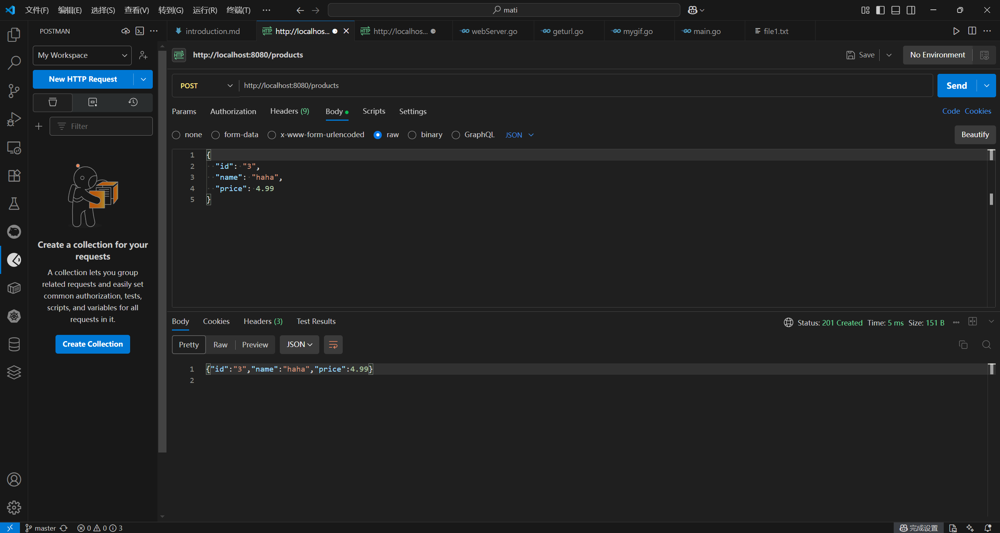
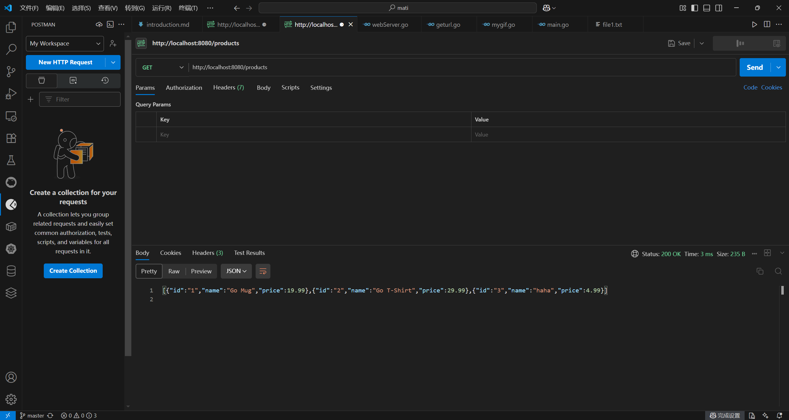

# 入门
真入门？那为什么要放在11章后面讲？😋

# 命令行参数
## in C
```C
int main(int argc, char *argv[]) {
    // argc - 参数计数
    // argv - 参数值数组
    for (int i = 0; i < argc; i++) {
        printf("参数 %d: %s\n", i, argv[i]);
    }
    return 0;
}
```


## in Go
```go
package main

import (
    "fmt"
    "os"
)

func main() {
    // os.Args 一个字符串切片
    // os.Args[0] 命令本身的名字
    // os.Args[1:] 后面的都是命令行传递的参数
    for i, arg := range os.Args {
        fmt.Printf("参数 %d: %s\n", i, arg)
    }
}
```

cmd中
```sh
# go build 生成main.exe可执行文件
E:\mati\go-demos\ch1>go build main.go

# 1 2 3是命令行参数
E:\mati\go-demos\ch1>main 1 2 3
参数 0: main
参数 1: 1
参数 2: 2
参数 3: 3

E:\mati\go-demos\ch1>main.exe 1 2 3
参数 0: main.exe
参数 1: 1
参数 2: 2
参数 3: 3
```

## Go's "flag"
使用`flag`包（正确应该也提到过）
```go
package main

import (
    "flag"
    "fmt"
)

func main() {
    // 定义参数
    // flag.type(commandName, defaultValue, help)
    name := flag.String("name", "Guest", "用户名")
    age := flag.Int("age", 0, "用户年龄")
    verbose := flag.Bool("v", false, "详细模式")
    
    // 解析参数
    flag.Parse()
    
    fmt.Printf("姓名: %s, 年龄: %d, 详细模式: %v\n", *name, *age, *verbose)
    fmt.Println("剩余参数:", flag.Args())
}
```

怎么跑呢？参数传递方法
```sh
# 再build一遍
go build main.go
# 这样传参
main --name=seuer --age=20 -v=true
# 建议是多字母标志--(e.g.--name) 单字母标志-(e.g. -v)
# 但是Go的flag包比较灵活，但横线可用于所以标志(-name / --name都√)
main -name=seuer -age=20 -v=true
# 布尔标志-v 默认就是-v=true
main --name=seuer --age=20 -v
# 可以=赋值 也可以空格分隔赋值
main  --name seuer --age 20 -v
# -h / --help显示帮助信息
main -h

Usage of main:
  -age int
        用户年龄
  -name string
        用户名 (default "Guest")
  -v    详细模式

# 赋值有空格时，得加一个""，否则会被当成多个参数
main --name "seuer A" --age 20 -v
# main --name seuer A ×

# main --name seuer 与 main --name "seuer"效果相同，因为flag包会自动处理引号，将其剥离（大多数命令行工具的通用行为）

# 剩余标志？不是--或者-传入的参数
main --name "seuer A" --age 20 -v 1 2 3
# 姓名: seuer A, 年龄: 20, 详细模式: true
# 剩余参数: [1 2 3]
```

# 查找重复的行
文件操作
```go
func theSameLines() {
	// 统计数据
    counts := make(map[string]int)
	// 提供命令行参数获取文件路径
    for _, filename := range os.Args[1:] {
		// os.ReadFile()打开文件
        data, err := os.ReadFile(filename)
        if err != nil {
            fmt.Fprintf(os.Stderr, "dup3: %v\n", err)
            continue
        }
		// 过滤空行，分割成一行一行的数据
        for _, line := range strings.Fields(string(data)) {
   			counts[line]++
		}
    }
    for line, n := range counts {
        if n > 1 {
            fmt.Printf("%d\t%s\n", n, line)
        }
    }
}
```

# GIF动画
image相关操作 / 图形编程
```go
// Lissajous generates GIF animations of random Lissajous figures.
package mygif

import (
    "image"
    "image/color"
    "image/gif"
    "io"
    "math"
    "math/rand/v2"
    "os"
)

// 调色板，可选：白/黑
var palette = []color.Color{color.White, color.Black}

const (
    whiteIndex = 0
    blackIndex = 1
)

func mygif() {
    // The sequence of images is deterministic unless we seed
    // the pseudo-random number generator using the current time.
    // Thanks to Randall McPherson for pointing out the omission.
    // rand.Seed(time.Now().UTC().UnixNano()) rand.Seed()已弃用
    lissajous(os.Stdout)
}

func lissajous(out io.Writer) {
    const (
        cycles  = 5     // number of complete x oscillator revolutions
        res     = 0.001 // angular resolution
        size    = 100   // image canvas covers [-size..+size]
        nframes = 64    // number of animation frames
        delay   = 8     // delay between frames in 10ms units
    )

    freq := rand.Float64() * 3.0 // relative frequency of y oscillator
    anim := gif.GIF{LoopCount: nframes}
    phase := 0.0 // phase difference
    // 生成每一帧
    for i := 0; i < nframes; i++ {
        rect := image.Rect(0, 0, 2*size+1, 2*size+1)
        img := image.NewPaletted(rect, palette)
        for t := 0.0; t < cycles*2*math.Pi; t += res {
            x := math.Sin(t)
            y := math.Sin(t*freq + phase)
            img.SetColorIndex(size+int(x*size+0.5), size+int(y*size+0.5),
                blackIndex)
        }
        phase += 0.1
        anim.Delay = append(anim.Delay, delay)
        anim.Image = append(anim.Image, img)
    }
    gif.EncodeAll(out, &anim) // NOTE: ignoring encoding errors
}
```

运行
```sh
go build main.go

main >out.gif
```

# 获取URL
http相关操作 / 网络服务
```go
// Fetch prints the content found at a URL.
package main

import (
    "fmt"
    "io"
    "net/http"
    "os"
)

func main() {
    for _, url := range os.Args[1:] {
        // http.Get() http的get方法
        resp, err := http.Get(url)
        if err != nil {
            fmt.Fprintf(os.Stderr, "fetch: %v\n", err)
            os.Exit(1)
        }
        // 获取response的body部分(<html>...)
        b, err := io.ReadAll(resp.Body)
        resp.Body.Close()
        if err != nil {
            fmt.Fprintf(os.Stderr, "fetch: reading %s: %v\n", url, err)
            os.Exit(1)
        }
        fmt.Printf("%s", b)
    }
}
```

运行
```sh
# 还是先build
go build main.go
# 再获取url(命令行参数)
main http://gopl.io

<html>
<head>
<title>The Go Programming Language</title>title>
...
```

# 并发获取多个URL
为并发 goroutine & channel 做铺垫（属于复习了是😋👍）

```go
// Fetchall fetches URLs in parallel and reports their times and sizes.
package main

import (
    "fmt"
    "io"
    "net/http"
    "os"
    "time"
)

func main() {
    start := time.Now()
    ch := make(chan string)
    for _, url := range os.Args[1:] {
        go fetch(url, ch) // start a goroutine
    }
    for range os.Args[1:] {
        fmt.Println(<-ch) // receive from channel ch
    }
    fmt.Printf("%.2fs elapsed\n", time.Since(start).Seconds())
}

func fetch(url string, ch chan<- string) {
    start := time.Now()
    resp, err := http.Get(url)
    if err != nil {
        ch <- fmt.Sprint(err) // send to channel ch
        return
    }
    nbytes, err := io.Copy(io.Discard, resp.Body)
    resp.Body.Close() // don't leak resources
    if err != nil {
        ch <- fmt.Sprintf("while reading %s: %v", url, err)
        return
    }
    secs := time.Since(start).Seconds()
    ch <- fmt.Sprintf("%.2fs  %7d  %s", secs, nbytes, url)
}
```

go触发多个并行goroutines，channel用来传递消息

```sh
# 还是先build
main https://golang.org http://gopl.io https://godoc.org
# 同时并行获取3个URL
1.53s    33470  https://godoc.org
3.10s     4154  http://gopl.io
Get "https://golang.org": dial tcp 142.250.204.49:443: connectex: A connection attempt failed because the connected party did not properly respond after a period of time, or established connection failed because connected host has failed to respond.
21.20s elapsed
# 前两个连上了最后一个寄了，没梯子导致的😋
```

# Web服务
make `http` greater again!🥳
```go
package main

import (
	"encoding/json"
	"log"
	"net/http"
	"time"

	"github.com/gorilla/mux"
)

type Product struct {
	ID    string  `json:"id"`
	Name  string  `json:"name"`
	Price float64 `json:"price"`
}

var products = []Product{
	{"1", "Go Mug", 19.99},
	{"2", "Go T-Shirt", 29.99},
}

func main() {
	r := mux.NewRouter()

	// 中间件
	r.Use(loggingMiddleware)

	// 路由
	r.HandleFunc("/", homeHandler).Methods("GET")
	r.HandleFunc("/products", listProductsHandler).Methods("GET")
	r.HandleFunc("/products/{id}", getProductHandler).Methods("GET")
	r.HandleFunc("/products", createProductHandler).Methods("POST")

	// 静态文件服务
	r.PathPrefix("/static/").Handler(http.StripPrefix("/static/", 
		http.FileServer(http.Dir("static"))))

	// 启动服务器
	srv := &http.Server{
		Handler:      r,
		Addr:         ":8080",
		WriteTimeout: 15 * time.Second,
		ReadTimeout:  15 * time.Second,
	}

	log.Println("Server started on :8080")
	log.Fatal(srv.ListenAndServe())
}

// 中间件示例
func loggingMiddleware(next http.Handler) http.Handler {
	return http.HandlerFunc(func(w http.ResponseWriter, r *http.Request) {
		log.Printf("%s %s %s", r.RemoteAddr, r.Method, r.URL)
		next.ServeHTTP(w, r)
	})
}

func homeHandler(w http.ResponseWriter, r *http.Request) {
	fmt.Fprint(w, "<h1>Product API Service</h1>")
}

func listProductsHandler(w http.ResponseWriter, r *http.Request) {
	w.Header().Set("Content-Type", "application/json")
	json.NewEncoder(w).Encode(products)
}

func getProductHandler(w http.ResponseWriter, r *http.Request) {
	vars := mux.Vars(r)
	id := vars["id"]

	for _, p := range products {
		if p.ID == id {
			w.Header().Set("Content-Type", "application/json")
			json.NewEncoder(w).Encode(p)
			return
		}
	}

	http.NotFound(w, r)
}

func createProductHandler(w http.ResponseWriter, r *http.Request) {
	var newProduct Product
	if err := json.NewDecoder(r.Body).Decode(&newProduct); err != nil {
		http.Error(w, err.Error(), http.StatusBadRequest)
		return
	}

	products = append(products, newProduct)
	w.Header().Set("Content-Type", "application/json")
	w.WriteHeader(http.StatusCreated)
	json.NewEncoder(w).Encode(newProduct)
}
```

`go run main.go`启动Web服务

访问:
http://localhost:8080/api/hello

http://localhost:8080/products

除了get还可以搞post
e.g.
```
{"id":"3","name":"haha","price":9.99}
```
发送给http://localhost:8080/products


POST方法新建商品 `haha`(9块9毛9九😋)

再查询看到有了


