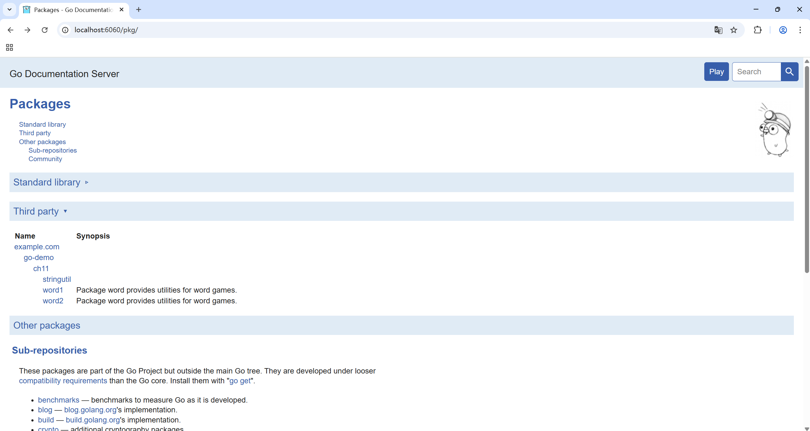
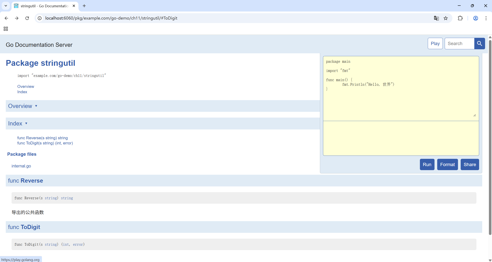

# 测试Test
why test?
洛谷/力扣刷题，提交后跑测试样例，样例全过AC，否则WA（or others）
真正开发，可没有这样的洛谷来帮我们跑测试样例看对不对，需要我们自己搞一些小程序&小样例来测试一下

Maurice Wilkes，第一个存储程序计算机EDSAC的设计者，1949年他在实验室爬楼梯时有一个顿悟。

忽然间有一种醍醐灌顶的感觉，我整个后半生的美好时光都将在寻找程序BUG中度过了 ——Maurice Wilkes《计算机先驱回忆录》

软件测试是一个巨大的领域。测试的任务可能已经占据了一些程序员的部分时间和另一些程序员的全部时间。

Go Lang的测试？go test测试命令！编写测试代码和编写普通的Go代码过程是类似的；它并不需要学习新的符号、规则和工具。

# go test
在包目录内，所有以`_test.go`为后缀名的文件在go build是不会被构建，only for `go test` 忠诚！🥰
e.g. `eg_test.go`

在`*_test.go`文件中，有三种类型的函数
1. 测试函数，以`Test`为函数名前缀，e.g.`func TestEg()`，测试一些逻辑行为是否正确（是否AC😋）
2. 基准测试函数，以`Benchmark`为函数名前缀，e.g.`func BenchmarkEg()`，测试函数性能 / 运行时间
3. 示例函数，以`Example`为函数名前缀，e.g.`func ExampleEg()`，提供一个由编译器保证正确性的示例文档

go test命令，遍历`*_test.go`文件中的上述函数，生成一个临时的main包调用它们（cos go build），接着构建并运行、报告测试结果，最后清理测试中生成的临时文件

# 测试函数 Test
## 基本概念
`testing`包重度依赖😘
```go
func TestName(t *testing.T) {
    // ...
}
```

e.g.
```go
func TestSin(t *testing.T) { /* ... */ }
func TestCos(t *testing.T) { /* ... */ }
func TestLog(t *testing.T) { /* ... */ }
// Test后面的首字母必须大写！
```

`t *testing.T`?，报告测试失败和日志信息

## e.g.
### PASS
`package word`里有一个判断回文的`IsPalindrome()`的函数，我来测一测🥰
```go
// Package word provides utilities for word games.
package word

// IsPalindrome reports whether s reads the same forward and backward.
// (Our first attempt.)
func IsPalindrome(s string) bool {
    for i := range s {
        if s[i] != s[len(s)-1-i] {
            return false
        }
    }
    return true
}
```

`word_test.go`, 包含`TestPalindrome()`和`TestNonPalindrome()`两个测试函数，用`t.Error`报告失败信息
```go
package word

import "testing"

func TestPalindrome(t *testing.T) {
    // "detartrated", "kayak"是自己造的测试样例
    if !IsPalindrome("detartrated") {
        t.Error(`IsPalindrome("detartrated") = false`)
    }
    if !IsPalindrome("kayak") {
        t.Error(`IsPalindrome("kayak") = false`)
    }
}

func TestNonPalindrome(t *testing.T) {
    // "palindrome"也是样例
    if IsPalindrome("palindrome") {
        t.Error(`IsPalindrome("palindrome") = true`)
    }
}
```

go test怎么test？直接go test就好啦！
```sh
# cd _test.go文件所在文件夹
go test
# PASS
# ok      example.com/go-demo/ch11/word   0.146s
```

### FAIL
3个样例也算过？再来几个
```go
func TestFrenchPalindrome(t *testing.T) {
    // french?
    if !IsPalindrome("été") {
        t.Error(`IsPalindrome("été") = false`)
    }
}

func TestCanalPalindrome(t *testing.T) {
    // 标点&空格？？
    input := "A man, a plan, a canal: Panama"
    if !IsPalindrome(input) {
        t.Errorf(`IsPalindrome(%q) = false`, input)
    }
}
```

```sh
go test

--- FAIL: TestFrenchPalindrome (0.00s)
    word_test.go:22: IsPalindrome("été") = false
--- FAIL: TestCanalPalindrome (0.00s)
    word_test.go:29: IsPalindrome("A man, a plan, a canal: Panama") = false
FAIL
exit status 1
FAIL    example.com/go-demo/ch11/word1  0.484s
```

不亏我呕心沥血不择手段搞样例，寄了吧😋

### go test -args
```sh
go test -v
```
`-v` 可用于打印每个测试函数的名字和运行时间
```sh
=== RUN   TestPalindrome
--- PASS: TestPalindrome (0.00s)
=== RUN   TestNonPalindrome
--- PASS: TestNonPalindrome (0.00s)
=== RUN   TestFrenchPalindrome
    word_test.go:22: IsPalindrome("été") = false
--- FAIL: TestFrenchPalindrome (0.00s)
=== RUN   TestCanalPalindrome
    word_test.go:29: IsPalindrome("A man, a plan, a canal: Panama") = false
--- FAIL: TestCanalPalindrome (0.00s)
FAIL
exit status 1
FAIL    example.com/go-demo/ch11/word1  0.143s
```

---
```go
go test -run="..."
```
`-run`对应一个正则表达式，只有测试函数名被它正确匹配的测试函数才会被go test测试命令运行
```sh
go test -v -run="French|Canal"
# 名字里有French 或者 Canal的才会被运行
=== RUN   TestFrenchPalindrome
    word_test.go:22: IsPalindrome("été") = false
--- FAIL: TestFrenchPalindrome (0.00s)
=== RUN   TestCanalPalindrome
    word_test.go:29: IsPalindrome("A man, a plan, a canal: Panama") = false
--- FAIL: TestCanalPalindrome (0.00s)
FAIL
exit status 1
FAIL    example.com/go-demo/ch11/word1  0.137s
```

### AC code
法语？unicode字符，`[]byte`换成`[]rune`
空格符号大小写？遍历提取字母，且统统转换成小写
```go
// Package word provides utilities for word games.
package word

import "unicode"

// IsPalindrome reports whether s reads the same forward and backward.
// Letter case is ignored, as are non-letters.
func IsPalindrome(s string) bool {
    var letters []rune
    for _, r := range s {
        if unicode.IsLetter(r) {
            letters = append(letters, unicode.ToLower(r))
        }
    }
    for i := range letters {
        if letters[i] != letters[len(letters)-1-i] {
            return false
        }
    }
    return true
}
```

再多来几个测试样例
```go
func TestIsPalindrome(t *testing.T) {
    // more pretty!
    var tests = []struct {
        input string
        want  bool
    }{
        {"", true},
        {"a", true},
        {"aa", true},
        {"ab", false},
        {"kayak", true},
        {"detartrated", true},
        {"A man, a plan, a canal: Panama", true},
        {"Evil I did dwell; lewd did I live.", true},
        {"Able was I ere I saw Elba", true},
        {"été", true},
        {"Et se resservir, ivresse reste.", true},
        {"palindrome", false}, // non-palindrome
        {"desserts", false},   // semi-palindrome
    }
    for _, test := range tests {
        if got := IsPalindrome(test.input); got != test.want {
            t.Errorf("IsPalindrome(%q) = %v", test.input, got)
        }
    }
}
```

测一下！
```sh
go test -v

=== RUN   TestIsPalindrome
--- PASS: TestIsPalindrome (0.00s)
PASS
ok      example.com/go-demo/ch11/word2  0.141s
```

## 随机测试
随机数随一点样例嘛（判题机最爱的随机数生成器？），这样可以发现一些unexpected error，比如说刚才的法语

怎么测呢？
1. 有一个已知正确的判断回文的函数，看看两个对随机的数据的答案（true / false）是不是都是一样的
2. 专门构造回文数据，测一测是不是都是true

## 测试一个命令
main包？main包既是可执行入口，也是可测试包！

main包虽然用于生成可执行文件，但依然可以像普通包一样用go test进行测试

e.g.
C
```C
// main.c
#include <stdio.h>

int main() {
    printf("Hello World");  // 逻辑直接写在main函数中
    return 0;
}
```
必须编译执行整个程序并看看输出如何，无法只单独测试main中的一个逻辑片段

But in Go，你可以为`main.go`写一个`main_test.go`，来测试main or 其中的一个逻辑片段

```go
// main_test.go
package main

import "testing"

func TestRealLogic(t *testing.T) {
    got := realLogic() // func realLogiic() string {return "Hello World"}
    want := "Hello World"
    if got != want {
        t.Errorf("got %q, want %q", got, want)
    }
}
```

逻辑分离：main()只处理启动参数、退出码等基础流程；核心逻辑拆分为普通函数（可独立测试）


## 白盒测试
vs 黑盒测试（只拿到接口，看输入~输出是不是expected的，内部实现对测试代码是透明的）

相反，白盒测试有访问包内部函数和数据结构的权限，因此可以做到一些普通客户端无法实现的测试

e.g. 测试未导出的内部函数和结构(小写字母开头)
被测代码`stringutil/internal.go`
```go
package stringutil

// 未导出的内部函数（首字母小写）
func reverseBytes(b []byte) {
	for i, j := 0, len(b)-1; i < j; i, j = i+1, j-1 {
		b[i], b[j] = b[j], b[i]
	}
}

// 导出的公共函数
func Reverse(s string) string {
	b := []byte(s)
	reverseBytes(b) // 调用内部实现
	return string(b)
}
```

白盒测试代码`stringutil/internal_test.go`
```go
package stringutil

import "testing"

// 测试未导出的 reverseBytes 函数
func TestReverseBytes(t *testing.T) {
	tests := []struct {
		input []byte
		want  []byte
	}{
		{[]byte("hello"), []byte("olleh")},
		{[]byte("a"), []byte("a")},
		{[]byte(""), []byte("")},
	}

	for _, tt := range tests {
		// 复制一份input，避免修改原数据
		inputCopy := make([]byte, len(tt.input))
		copy(inputCopy, tt.input)
		
		reverseBytes(inputCopy) // 直接调用未导出函数
		
		if string(inputCopy) != string(tt.want) {
			t.Errorf("reverseBytes(%q) = %q, want %q", 
				tt.input, inputCopy, tt.want)
		}
	}
}

// 同时也可以测试导出的Reverse函数
func TestReverse(t *testing.T) {
	if got := Reverse("hello"); got != "olleh" {
		t.Errorf("Reverse() = %q, want %q", got, "olleh")
	}
}
```

测试运行
```sh
go test -v

=== RUN   TestIsPalindrome
--- PASS: TestIsPalindrome (0.00s)
PASS
ok      example.com/go-demo/ch11/word2  0.141s
PS E:\mati\go-demos\ch11\word2> cd ..
PS E:\mati\go-demos\ch11> cd .\stringutil\
PS E:\mati\go-demos\ch11\stringutil> go test -v
=== RUN   TestReverseBytes
--- PASS: TestReverseBytes (0.00s)
=== RUN   TestReverse
--- PASS: TestReverse (0.00s)
PASS
ok      example.com/go-demo/ch11/stringutil     0.487s
```

可以测试未导出的函数（如 reverseBytes）
可以访问未导出的结构体字段
白盒测试的大手已经伸到了内部实现细节里面力！😋


## 外部测试包
避免循环依赖

循环依赖
e.g. 测试`net/http`需要使用`net/url`，而`net/url`又引用了`net/http`
互相import = 环 = 循环引用 = 寄😋

```
net/http---->net/url
        <----(test)

cycle!
```

哎，整一个外部测试包，本来要测试`net/url`的，那这个外部测试包就叫`net/url_test`
```
net/url
|           \
|            \
net/http---->net/url

no cycle!
```

## 有效的测试？
1. only yes or no
```go
package hello

import "testing"

func TestRealLogic(t *testing.T) {
    got := realLogic() // func realLogiic() string {return "Hello World"}
    want := "Hello World"
    if got != want {
        t.Errorf("Wrong!")
    }
}
```

2. 更多详细信息
```go
package hello

import "testing"

func TestRealLogic(t *testing.T) {
    got := realLogic() // func realLogiic() string {return "Hello World"}
    want := "Hello World"
    if got != want {
        // got & want
        t.Errorf("got %q, want %q", got, want)
    }
}
```

## 避免脆弱的测试
稍微改一改测试就寄了😋
《就像一个不够稳健的程序会挫败它的用户一样，一个脆弱的测试同样会激怒它的维护者》

危·😋·危

最好不要搞特别精细的测试，像花瓶一样，看着好看，碰碰就碎了
e.g.过度精确的字符串匹配（如完整HTML输出比对）

测试应该关注核心逻辑，而非实现细节

e.g.政治题没必要一字不错和书完全一样，只提取关心关键词就OK

让测试像质量守门员而非代码警察😘

# 测试覆盖率
样例全对，就真对了吗？😋

题目1e6的数据样例只有1e3，$n^2$都闭着眼过了，差评！😡

测试覆盖率，你的测试样例到底好不好

这些启发式方法中，语句的覆盖率是最简单和最广泛使用的
语句覆盖率？测试中至少被运行一次的代码占总代码数的比例
`go tool cover`工具！
说明书：
```sh
$ go tool cover
Usage of 'go tool cover':
Given a coverage profile produced by 'go test':
    go test -coverprofile=c.out # 1. -coverprofile

Open a web browser displaying annotated source code:
    go tool cover -html=c.out # 2. -html
...
```
（1. 2. 按顺序来！）
（还有，在cmd里运行！powershell会出错！（Windows的ps老毛病了））


比如对包stringutil进行测试
```sh
go test -coverprofile=c.out

PASS
coverage: 38.5% of statements
ok      example.com/go-demo/ch11/stringutil     0.156s
```
然后
```sh
go tool cover -html=c.out
```
如下所示


绿色就是测试覆盖到的地方，红色就是没覆盖到的地方

# 基准测试
## 基本概念
Benchmark? 性能 / 运行时间！
`*testing.B`重度依赖😘
```go
// word2/word_test.go
import "testing"

func BenchmarkIsPalindrome(b *testing.B) {
    // 跑N次求平均运行时间
    for i := 0; i < b.N; i++ {
        IsPalindrome("A man, a plan, a canal: Panama")
    }
}
```

测试运行
```sh
go test -bench=.
# -bench手动指定要运行的基准测试函数，.就是全部
# 也可以go test -bench=IsPalindrome
goos: windows
goarch: amd64
pkg: example.com/go-demo/ch11/word2
cpu: AMD Ryzen 7 7840H w/ Radeon 780M Graphics
# -16 16个核 循环7178209次 每次166.2ns
BenchmarkIsPalindrome-16         7178209               166.2 ns/op
PASS
ok      example.com/go-demo/ch11/word2  1.866s
```
只有时间，没有空间吗🤔

有点兄弟有的！`-benchmem`!🥳
```sh
go test -bench=. -benchmem

goos: windows
goarch: amd64
pkg: example.com/go-demo/ch11/word2
cpu: AMD Ryzen 7 7840H w/ Radeon 780M Graphics
# 248 B/op
BenchmarkIsPalindrome-16         6983068               162.8 ns/op           248 B/op          5 allocs/op      
PASS
ok      example.com/go-demo/ch11/word2  1.472s
```

## 剖析
《当我们试图让程序跑的更快的时候，我们通常并不知道从哪里开始优化》

优化谁呢？谁跑的慢就优化谁！
怎么知道谁跑的慢呢？`go test`剖析数据！

1. CPU剖析数据标识了最耗CPU时间的函数
2. 堆剖析则标识了最耗内存的语句
3. 阻塞剖析则记录阻塞goroutine最久的操作，例如系统调用、管道发送和接收，还有获取锁等

```sh
go test -cpuprofile=cpu.out
go test -blockprofile=block.out
go test -memprofile=mem.out
```

---
e.g.（圣经里的示例）
```sh
$ go test -run=NONE -bench=ClientServerParallelTLS64 \
    -cpuprofile=cpu.log net/http
 PASS
 BenchmarkClientServerParallelTLS64-8  1000
    3141325 ns/op  143010 B/op  1747 allocs/op
ok       net/http       3.395s

$ go tool pprof -text -nodecount=10 ./http.test cpu.log
2570ms of 3590ms total (71.59%)
Dropped 129 nodes (cum <= 17.95ms)
Showing top 10 nodes out of 166 (cum >= 60ms)
    flat  flat%   sum%     cum   cum%
  1730ms 48.19% 48.19%  1750ms 48.75%  crypto/elliptic.p256ReduceDegree
   230ms  6.41% 54.60%   250ms  6.96%  crypto/elliptic.p256Diff
   120ms  3.34% 57.94%   120ms  3.34%  math/big.addMulVVW
   110ms  3.06% 61.00%   110ms  3.06%  syscall.Syscall
    90ms  2.51% 63.51%  1130ms 31.48%  crypto/elliptic.p256Square
    70ms  1.95% 65.46%   120ms  3.34%  runtime.scanobject
    60ms  1.67% 67.13%   830ms 23.12%  crypto/elliptic.p256Mul
    60ms  1.67% 68.80%   190ms  5.29%  math/big.nat.montgomery
    50ms  1.39% 70.19%    50ms  1.39%  crypto/elliptic.p256ReduceCarry
    50ms  1.39% 71.59%    60ms  1.67%  crypto/elliptic.p256Sum
```

---
实际（测试stringutil包）
```sh
go test -cpuprofile=cpu.out

PASS
ok      example.com/go-demo/ch11/stringutil     0.775s

# 然后生成cpu.out和stringutil.test.exe两个文件

go tool pprof -text -nodecount=10 ./stringutil.test.exe cpu.out

File: stringutil.test.exe
Build ID: C:\Users\26685\AppData\Local\Temp\go-build1079427270\b001\stringutil.test.exe2025-07-22 19:02:07.2677924 +0800 CST
Type: cpu
Time: 2025-07-22 19:02:07 CST
Duration: 213.30ms, Total samples = 0
Showing nodes accounting for 0, 0% of 0 total
      flat  flat%   sum%        cum   cum%

# 啥都没有，太逊了导致的😋
```

# 示例函数
## 基本概念
Example

e.g.
```go
func ExampleIsPalindrome() {
    fmt.Println(IsPalindrome("A man, a plan, a canal: Panama"))
    fmt.Println(IsPalindrome("palindrome"))
    // Output:
    // true
    // false
}
```

1. 示例，像文档一样演示用法
2. go test 也会测试示例，并检查输出和注释是否匹配（注释最有用的一集😘）
3. 真实的演练场： http://golang.org 就是由godoc提供的文档服务，它使用了Go Playground让用户可以在浏览器中在线编辑和运行每个示例函数


测试运行
直接go test也会顺道带上Example的

or
```sh
# 运行所有示例
go test -run=Example

# 只运行IsPalindrome的示例
go test -run=ExampleIsPalindrome

# 输出
PASS
ok      example.com/go-demo/ch11/word2  0.138s
```

## 类似golang.org的文档服务
```sh
# 安装godoc
go install golang.org/x/tools/cmd/godoc@latest
# 启动服务（默认端口6060）
godoc -http=:6060 -play
```

然后访问`http://localhost:6060`
doc is ready~🥳




