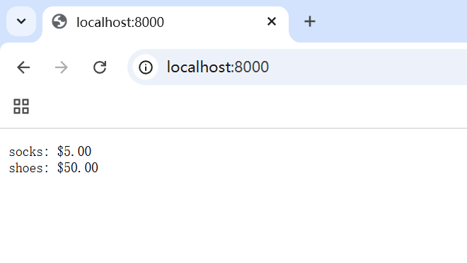
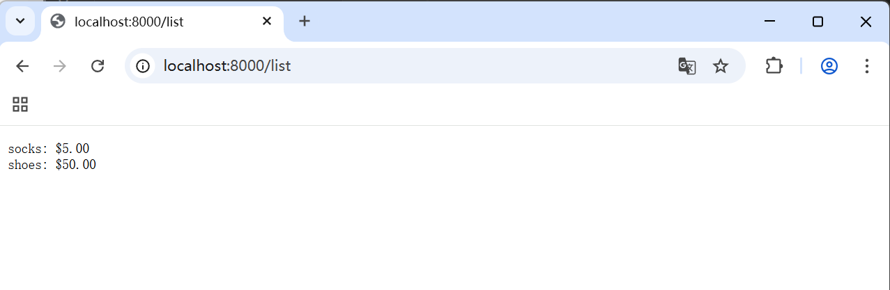
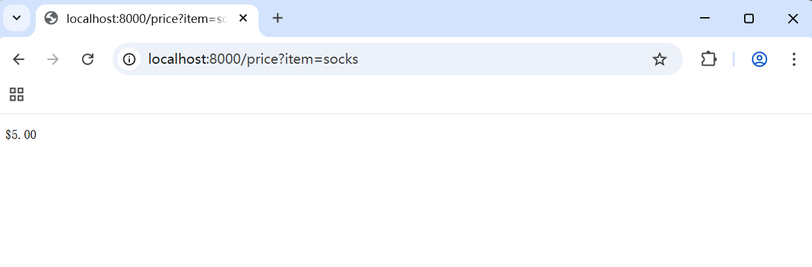
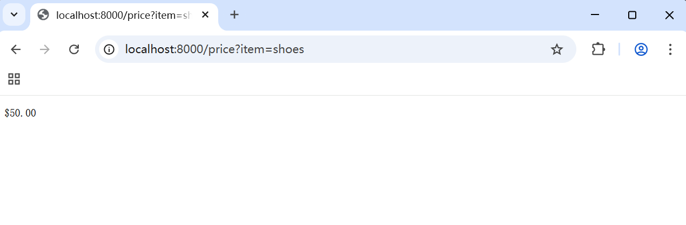

# 接口值
## 组成
```
接口值 = 
 ---------------
| dynamic type  |
 ---------------
| dynamic value |
 ---------------
```

动态类型：存储实现接口的具体类型
动态值：存储该类型的实际值

e.g.
```go
var w io.Writer      // 接口变量声明（此时类型和值均为nil）
w = os.Stdout        // 赋值后：类型=*os.File，值=os.Stdout
w = new(bytes.Buffer) // 重新赋值：类型=*bytes.Buffer，值=新创建的Buffer
```

## 底层实现
两个指针表示接口值
```go
type iface struct {
    tab  *itab          // 类型信息和方法表
    data unsafe.Pointer // 指向实际数据的指针
}
```

## 四种状态
4 = 1 + 2 +1
类型 nil & 值 nil
类型 非nil x 值 nil/非nil
空接口`interface{}`

### nil接口值（都为nil）
```go
var w io.Writer      // 类型和值均为nil
fmt.Println(w == nil) // true
```

### nil Type & non nil Value
```go
var buf *bytes.Buffer // 具体类型nil值
var w io.Writer = buf // 类型=*bytes.Buffer，值=nil
fmt.Println(w == nil) // false
```

### non nil Type & non nil Value
```go
w = os.Stdout        // 类型和值均非nil
fmt.Println(w == nil) // false
```

### 空接口值
```go
var any interface{}  // 空接口
any = 42             // 可以保存任何值
```
## 值为nil ≠ 接口为nil
```go
var buf io.Writer // 类型和值均为nil
// buf = new(bytes.Buffer)
// 如果赋值，下面的buf != nil为true
// 如果不赋值，下面的buf != nil为false
if buf != nil {
    buf.Write([]byte("hello\n"))
}
```

---
```go
var buf *bytes.Buffer // 值为nil，但类型不为nil
// buf = new(bytes.Buffer)
// 如果赋值，下面的buf != nil为true
// 如果不赋值，下面的buf != nil仍为true
// only值为nil(一个包含nil指针的接口)不是nil接口！
if buf != nil {
    buf.Write([]byte("hello\n"))
}
```


## OPS
### 类型断言
```go
var w io.Writer = os.Stdout
f, ok := w.(*os.File)    // 成功：f=os.Stdout, ok=true
b, ok := w.(*bytes.Buffer) // 失败：b=nil, ok=false
```

### 接口值比较
```go
var w1, w2 io.Writer
fmt.Println(w1 == w2) // true，都是nil接口值

w1 = os.Stdout
w2 = os.Stdout
fmt.Println(w1 == w2) // true，相同的动态类型和值

w2 = new(bytes.Buffer)
fmt.Println(w1 == w2) // false，动态类型不同
```

# sort.Interface接口
## 它定义sort
[]int、[]string和[]float64 有现成的sort
```go
arr := []int{3, 1, 2, 4}
sort.Ints(arr)
// 还有 sort.Strings() sort.Float64s()
fmt.Println(arr)
```

## 自定义sort
实现sort.Interface即可随地大小sort
### 接口定义
```go
type Interface interface {
    Len() int // 元素数量
    Less(i, j int) bool // 比较函数
    Swap(i, j int) // 交换函数
}
```
实现这三个函数 = 实现接口 = sort许可证

### e.g自定义结构体排序
```go
type Person struct {
    Name string
    Age  int
}

type ByAge []Person

func (a ByAge) Len() int           { return len(a) }
func (a ByAge) Less(i, j int) bool { return a[i].Age < a[j].Age }
func (a ByAge) Swap(i, j int)      { a[i], a[j] = a[j], a[i] }

func main() {
    people := ByAge{
        {"Bob", 31},
        {"Alice", 25},
        {"Eve", 28},
    }
    sort.Sort(people)
    fmt.Println(people) // [{Alice 25} {Eve 28} {Bob 31}]
}
```

## 反向排序？
小于号改成大于号，就是咯😋

咳咳，`sort.Reverse`函数！
```go
// arr []int
sort.Sort(sort.Reverse(sort.IntSlice(arr)))
// ByAge []Person
sort.Sort(sort.Reverse(ByAge(people)))
```

为啥还要`IntSlice()`, `ByAge()`?
Reverse原理：
```go
// package sort中的实现
type reverse struct {
	Interface // 嵌入原始接口
}

func (r reverse) Less(i, j int) bool {
	return r.Interface.Less(j, i) // 反转比较结果
}

// 要传入一个interface类型对象
// 而非原始的切片！
func Reverse(data Interface) Interface {
	return &reverse{data}
}
```

## 稳定排序
`sort.Stable`
```go
sort.Stable(sort.IntSlice(arr))
```

# http.Handler接口

## 定义
`net/http`包中`Handler`接口
```go
package http

type Handler interface {
    ServeHTTP(ResponseWriter, *Request) // 处理HTTP请求
}
```
`ResponseWriter`: 用于写入响应
`*Request`: 包含请求信息

---
`ListenAndServe`函数
```go
func ListenAndServe(address string, h Handler) error
```
`address`: 例如`localhost:8080`的服务器地址

`h`: 一个`Handler`接口实例

## e.g.
```go
// 使用map[string]float32 模拟一个数据库
type dollars float32

func (d dollars) String() string { return fmt.Sprintf("$%.2f", d) }

type database map[string]dollars

func (db database) ServeHTTP(w http.ResponseWriter, req *http.Request) {
    for item, price := range db {
        fmt.Fprintf(w, "%s: %s\n", item, price)
    }
}

func httpTest() {
	db := database{"shoes": 50, "socks": 5}
	log.Fatal(http.ListenAndServe("localhost:8000", db))
}
```

在`main`里运行`httpTest`
浏览器访问http://localhost:8000
发现


`db`实现了`ServeHTTP`方法（遍历&打印map信息），成为`Handler`接口的一个实例

## e.g.++
可以继续丰富`ServeHTTP`内容，这次可以根据不同URL路由进行不同的操作（就像访问不同网页）
```go
func (db database) ServeHTTP(w http.ResponseWriter, req *http.Request) {
    switch req.URL.Path {
    case "/list":
        for item, price := range db {
            fmt.Fprintf(w, "%s: %s\n", item, price)
        }
    case "/price":
        item := req.URL.Query().Get("item")
        price, ok := db[item]
        if !ok {
            w.WriteHeader(http.StatusNotFound) // 404
            fmt.Fprintf(w, "no such item: %q\n", item)
            // 上面两行也可以替换为
            // msg := fmt.Sprintf("no such page: %s\n", req.URL)
// http.Error(w, msg, http.StatusNotFound) // 404
            return
        }
        fmt.Fprintf(w, "%s\n", price)
    default:
        w.WriteHeader(http.StatusNotFound) // 404
        fmt.Fprintf(w, "no such page: %s\n", req.URL)
    }
}
```

`http://localhost:8000/list`:


`http://localhost:8000/price?item=socks`


`http://localhost:8000/price?item=shoes`


谁说golang不能搞web？😘

# error接口
## 定义
神秘的预定义`error`类型，而且没有解释它究竟是什么🤔

实际上它就是`interface`类型😋
这个类型有一个返回错误信息的单一方法：
```go
type error interface {
    Error() string
}
```

---
整个errors包仅有4行：
```go
package errors

func New(text string) error { return &errorString{text} }

type errorString struct { text string }

func (e *errorString) Error() string { return e.text }
```
我的天哪errors大人🥳

`errorString`特色结构体，且交由指针类型`*errorString`实现`Error()`方法，所以每个New函数的调用都分配了一个独特的和其他错误不相同的实例
So,
```go
fmt.Println(errors.New("EOF") == errors.New("EOF")) // "false"
```

# 表达式求值
e.g.
`sqrt(A / pi)`，其中`A = 87616, pi = math.Pi`

练手小代码，圣经倾情推送~😘

在文件夹eval中有详细实现，整合成`package eval`
